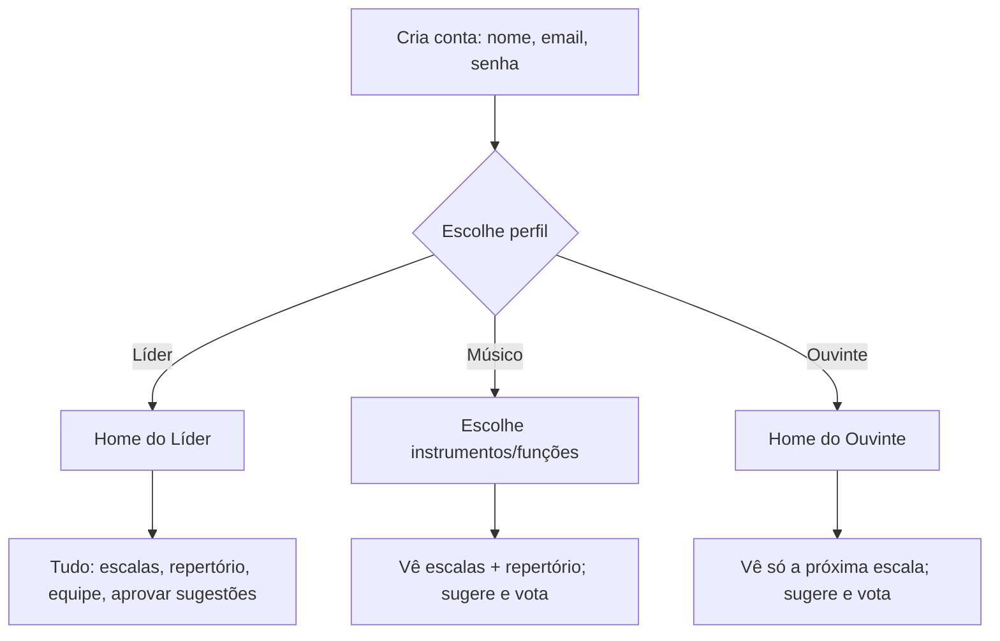
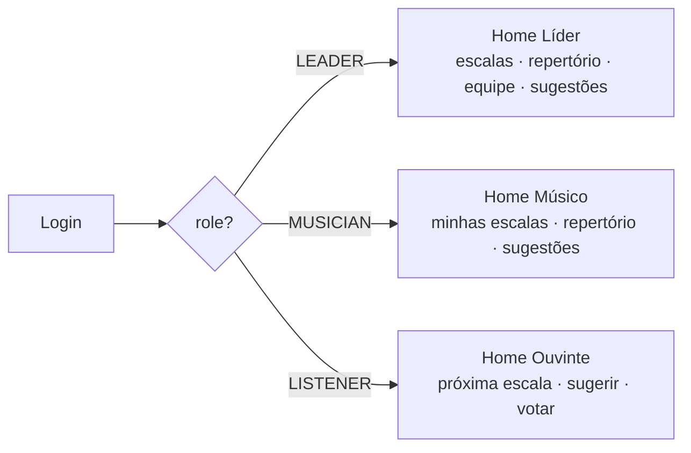
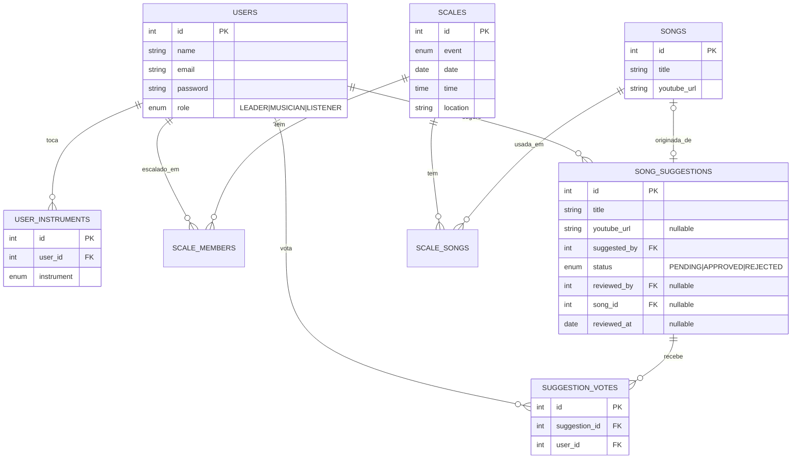
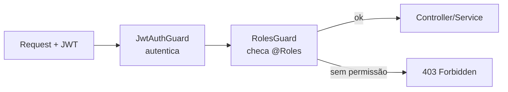
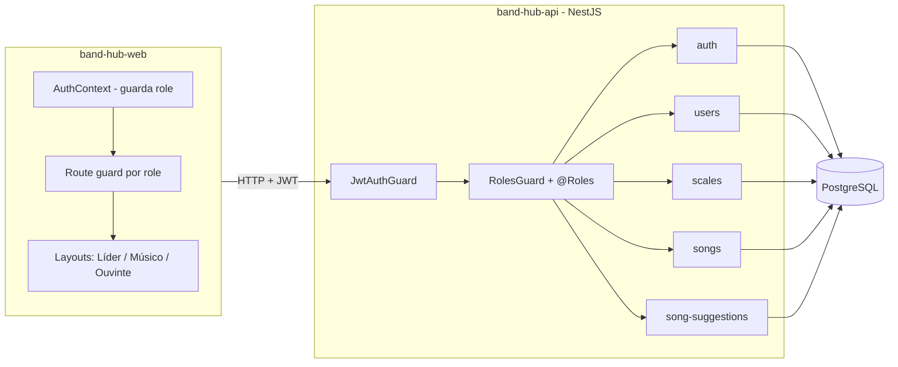

# Band Hub — Perfis, Sugestões de Música e Arquitetura

> Documento de design. Cobre **backend** (band-hub-api / NestJS), **frontend**
> (band-hub-web) e **banco** (PostgreSQL). Define os 3 perfis de usuário, o fluxo
> de sugestão/votação de músicas e as mudanças necessárias.

## 1. Objetivo

Permitir que diferentes pessoas participem da banda/comunidade com visões
distintas:

- O **Ouvinte** acompanha a próxima escala e contribui sugerindo músicas.
- A comunidade (ouvintes e músicos) **vota** nas sugestões para mostrar ao líder
  o que tem mais interesse.
- O **Líder** decide o que entra no repertório (aprovar/reprovar) e gerencia tudo.
- O **Músico** foca em tocar: vê escalas e repertório.

## 2. Perfis (roles)

São **4 perfis** no enum `UserRole` (valores em minúsculo no banco — ver
[convencao-enums.md](convencao-enums.md)):

| Enum (código) | Valor no banco | Nome exibido | Resumo |
|---------------|----------------|--------------|--------|
| `TECH`        | `tech`         | Desenvolvedor | Acesso irrestrito a tudo (perfil de dev) |
| `LEADER`      | `leader`       | Líder        | Acesso total ao domínio da banda |
| `MUSICIAN`    | `musician`     | Músico       | Vê escalas e repertório; sugere e vota |
| `LISTENER`    | `listener`     | Ouvinte      | Tela dedicada: próxima escala + sugerir/votar |

> `TECH` herda todas as permissões de `LEADER` e mais o que for de infraestrutura/
> desenvolvimento. No `RolesGuard`, `TECH` deve passar por qualquer checagem de role.

### 2.1 Matriz de permissões

| Recurso / Ação                         | Líder | Músico | Ouvinte |
|----------------------------------------|:-----:|:------:|:-------:|
| Ver **todas** as escalas               |  ✅   |   —    |   —     |
| Ver escalas em que está envolvido      |  ✅   |   ✅   |   —     |
| Ver **a próxima** escala               |  ✅   |   ✅   |   ✅    |
| Criar/editar escalas + escalar pessoas |  ✅   |   ❌   |   ❌    |
| Ver repertório aprovado                |  ✅   |   ✅   |   ❌    |
| Criar/editar repertório                |  ✅   |   ❌   |   ❌    |
| Sugerir música                         |  ✅   |   ✅   |   ✅    |
| Ver lista de sugestões                 |  ✅   |   ✅   |   ✅    |
| Votar em sugestão (1 voto, toggle)     |  —¹   |   ✅   |   ✅    |
| Aprovar / reprovar sugestão            |  ✅   |   ❌   |   ❌    |
| Gerenciar usuários                     |  ✅   |   ❌   |   ❌    |

¹ O líder é quem decide; não precisa votar.

## 3. Cadastro e roteamento por perfil



No cadastro, se o perfil for **Músico**, ele escolhe o que faz (um ou mais),
a partir do enum `Instrument`:

| Enum               | Exibição        |
|--------------------|-----------------|
| `VOCAL`            | Vocalista       |
| `BACKING_VOCAL`    | Back vocal      |
| `ACOUSTIC_GUITAR`  | Violão          |
| `ELECTRIC_GUITAR`  | Guitarra        |
| `BASS`             | Baixo           |
| `DRUMS`            | Bateria         |
| `KEYBOARD`         | Teclado         |
| `SOUND`            | Mesa de som     |
| `OTHER`            | Outro           |

## 4. Telas (frontend)

Após o login, o usuário é redirecionado para a home do seu perfil (com base no
`role` que vem no token / no `/auth/me`):

- **Líder** — dashboard completo: Escalas (CRUD + escalar pessoas), Repertório,
  Equipe, Sugestões (ranking por votos, aprovar/reprovar).
- **Músico** — Minhas escalas + Repertório (leitura) + Sugestões (sugerir/votar).
- **Ouvinte** — tela enxuta: card da **próxima escala** + menu **"Sugerir música"**
  + lista de sugestões com botão de **votar**.



## 5. Fluxo de sugestão e votação

```mermaid
sequenceDiagram
    actor U as Ouvinte/Músico
    participant API
    participant DB
    actor L as Líder

    U->>API: POST /song-suggestions (título, link)
    API->>DB: INSERT song_suggestions (status=PENDING)
    Note over U,L: Sugestão fica visível para todos

    U->>API: POST /song-suggestions/:id/vote
    API->>DB: INSERT suggestion_votes (UNIQUE user+sugestão)
    Note right of DB: 2º voto da mesma pessoa = remove (toggle)

    L->>API: GET /song-suggestions?status=PENDING (ordenado por votos)
    alt Líder aprova
        L->>API: PATCH /song-suggestions/:id/approve
        API->>DB: BEGIN; INSERT songs; UPDATE status=APPROVED, song_id; COMMIT
        Note over API,DB: A música entra no repertório
    else Líder reprova
        L->>API: PATCH /song-suggestions/:id/reject
        API->>DB: UPDATE status=REJECTED (não entra no repertório)
    end
```

Regras:

- Sugestão nasce `PENDING` e é visível a todos os perfis.
- Votação: **1 voto por pessoa por sugestão** (restrição única no banco). Votar de
  novo remove o voto (toggle). Ranking = `COUNT(votos)` desc.
- Aprovar é **transacional**: cria a `Song` e marca a sugestão como `APPROVED`
  apontando para o `song_id` criado.
- Reprovar apenas marca `REJECTED`; não cria música.

## 6. Modelo de dados

### 6.1 Diagrama ER (estado-alvo)



### 6.2 Mudanças no banco (resumo)

1. **`users.role`**: adicionar valor `LISTENER` ao enum existente
   (hoje só `LEADER`, `MUSICIAN`).
2. **`user_instruments`** (nova): instrumentos/funções do músico (N por usuário).
   - Alternativa mais simples: coluna `instrument` única em `users`
     (1 função só). Recomendado a tabela para permitir "vocal + violão".
3. **`song_suggestions`** (nova): sugestões com status e link para a `Song` criada.
4. **`suggestion_votes`** (nova): votos, com `UNIQUE (suggestion_id, user_id)`.
5. **(Recomendado, à parte)** transformar os ids soltos (`scale_id`, `user_id`,
   `song_id`) em relações reais com FK — hoje não há integridade referencial.

> O projeto usa `synchronize: true` (TypeORM cria/altera tabelas a partir das
> entidades). Em dev, basta declarar as entidades. Para produção, migrar para
> migrations antes de mexer em enums/colunas existentes.

### 6.3 DDL de referência (PostgreSQL)

```sql
-- 1. novo valor de role
ALTER TYPE users_role_enum ADD VALUE IF NOT EXISTS 'LISTENER';

-- 2. instrumentos do músico
CREATE TYPE instrument_enum AS ENUM
  ('VOCAL','BACKING_VOCAL','ACOUSTIC_GUITAR','ELECTRIC_GUITAR',
   'BASS','DRUMS','KEYBOARD','SOUND','OTHER');

CREATE TABLE user_instruments (
  id          SERIAL PRIMARY KEY,
  user_id     INT NOT NULL REFERENCES users(id) ON DELETE CASCADE,
  instrument  instrument_enum NOT NULL,
  UNIQUE (user_id, instrument)
);

-- 3. sugestões de música
CREATE TYPE suggestion_status_enum AS ENUM ('PENDING','APPROVED','REJECTED');

CREATE TABLE song_suggestions (
  id            SERIAL PRIMARY KEY,
  title         VARCHAR NOT NULL,
  youtube_url   VARCHAR,
  suggested_by  INT NOT NULL REFERENCES users(id),
  status        suggestion_status_enum NOT NULL DEFAULT 'PENDING',
  reviewed_by   INT REFERENCES users(id),
  song_id       INT REFERENCES songs(id),
  reviewed_at   TIMESTAMP,
  "createdAt"   TIMESTAMP NOT NULL DEFAULT now(),
  "updatedAt"   TIMESTAMP NOT NULL DEFAULT now()
);

-- 4. votos (1 por pessoa por sugestão)
CREATE TABLE suggestion_votes (
  id             SERIAL PRIMARY KEY,
  suggestion_id  INT NOT NULL REFERENCES song_suggestions(id) ON DELETE CASCADE,
  user_id        INT NOT NULL REFERENCES users(id) ON DELETE CASCADE,
  "createdAt"    TIMESTAMP NOT NULL DEFAULT now(),
  UNIQUE (suggestion_id, user_id)
);
```

## 7. API (backend NestJS)

### 7.1 Novos / alterados endpoints

| Método | Rota                              | Perfis            | Descrição |
|--------|-----------------------------------|-------------------|-----------|
| POST   | `/auth/register`                  | público           | Agora aceita `role` e `instruments[]`; **deve hashear a senha** |
| GET    | `/auth/me`                        | autenticado       | Retorna perfil + role (para o front rotear) |
| POST   | `/song-suggestions`               | todos autenticados| Cria sugestão (`PENDING`) |
| GET    | `/song-suggestions`               | todos autenticados| Lista com `voteCount` e `votedByMe`; filtro `?status=` e ordenação por votos |
| POST   | `/song-suggestions/:id/vote`      | Músico, Ouvinte   | Vota (toggle) |
| DELETE | `/song-suggestions/:id/vote`      | Músico, Ouvinte   | Remove voto (se preferir não usar toggle) |
| PATCH  | `/song-suggestions/:id/approve`   | Líder             | Aprova → cria `Song` (transação) |
| PATCH  | `/song-suggestions/:id/reject`    | Líder             | Reprova |
| GET    | `/scales/next`                    | todos autenticados| Próxima escala (usada pela tela do Ouvinte) |

### 7.2 Autorização (peça-chave de arquitetura)

Hoje só existe **autenticação** (`JwtAuthGuard`). Falta **autorização por perfil**.
Adicionar:

1. Incluir `role` no payload do JWT (hoje só `sub` e `email`) em
   `auth.service.ts`.
2. Criar `@Roles(...)` (decorator) + `RolesGuard` que lê o role do token e
   bloqueia quem não tem permissão.
3. Aplicar nos controllers, ex.: `@Roles('LEADER')` em approve/reject.



### 7.3 Correções/aproveitamentos no código atual

- **Bug a corrigir**: `UsersService.create` salva senha em texto puro — deve
  hashear (bcrypt), igual ao `auth.service`. Senão o login quebra para usuários
  criados por `POST /users`.
- **`scale_members.role_in_scale`** hoje é `string` livre; pode passar a usar o
  enum `Instrument` (função do músico naquela escala).

## 8. Arquitetura geral



- **Backend**: mantém o padrão modular do NestJS. Novidades: camada de
  autorização (RolesGuard) e o módulo `song-suggestions` (com serviço de
  aprovação transacional que gera a `Song`).
- **Frontend**: contexto de auth com o `role`, guard de rotas e três layouts;
  redirecionamento pós-login conforme o perfil.
- **Banco**: PostgreSQL; 2 tabelas novas (`song_suggestions`, `suggestion_votes`),
  1 tabela de instrumentos e 1 valor novo de enum.

## 9. Plano de implementação sugerido (fases)

1. **Fundação de autorização**: role no JWT + `RolesGuard`/`@Roles`; `/auth/me`;
   corrigir hash de senha em `UsersService`.
2. **Perfil Ouvinte + instrumentos**: `LISTENER` no enum; `user_instruments`;
   `register` aceitando role e instrumentos; `/scales/next`.
3. **Sugestões**: módulo `song-suggestions` (criar/listar) + aprovação
   transacional que cria a `Song`.
4. **Votação**: `suggestion_votes` + endpoint de voto (toggle) + ranking.
5. **Frontend**: roteamento por perfil + três telas (Líder, Músico, Ouvinte).

---

### Decisões registradas

- Terceiro perfil chamado **Ouvinte** (`LISTENER`).
- Músico vê **escalas + repertório**; também pode **sugerir e votar**.
- Votação: **Ouvintes e músicos**, **1 voto por pessoa** por sugestão (toggle).
